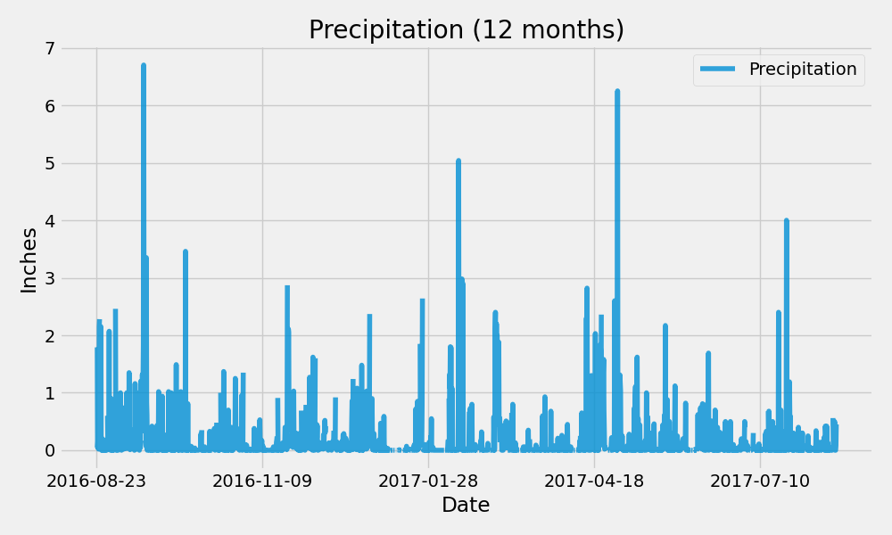

# sqlalchemy-challenge
## Background
This repository is desinged to make climate analysis on Honolulu, Hawaii to help clients trip planning and outline when they can plan their vacation.

## Step 1 - Climate Analysis and Exploration

To begin, used Python and SQLAlchemy to do basic climate analysis and data exploration of the climate database. All of the following analysis completed using SQLAlchemy ORM queries, Pandas, and Matplotlib.

  - Used the provided files ```climate_starter.ipnb``` and ```hawaii.sqlite``` to complete my analysis and data exploration.
  * Used the SQLALchemy ```create_engine()``` function to connect to my SQLite database.
  * Used the SQLALchemy ```automap_base()``` function to reflect my tables into classes, and then save references to the classes named ```station``` and ```measurement```.
  * Link Python to the database by creating a SQLALchemy session.

 ## Precipitation Analysis 

 * Design a query to retireve the last 12 months of precipitation data
 * Select only the ```date``` and ```prcp``` values.
 * Load the query results into a Pandas DataFrame and set the index to the date column.
 * Sort the DataFrame values by ```date```.
 * Plot the results using the DataFrame ```plot``` method.

  

 ## Station Analysis

 * Design a query to calculate the total number of stations.
 * Design a query to find the most active stations.
     - List the station and observation counts in descending order.
     - Which station has the highest number of observations?
     
* Design a query to retireve the last 12 months of temperature observation data(tobs).
    * Filter by the station with the highest number of observations.
    * Plot the results as histogram with ```bins=12```.


## Step 2 - Climate App

Now that I have completed my initial analysis, I designed a Flask API based on the queries that I have just developed.

* Used FLASK to create routes.

### Routes
* ```/ ```
  * Home page
  * List of all routes thar are available

* ``` /api/v1.0/precipitation  ```
  * Convert the query results to a Dictionary using ```date``` as the key and ```prcp``` as the value.
  * Return the JSON representation of your dictionary.

* ``` /api/v1.0/stations ```

  * query for the dates and temperature observations from a year from the last data point.
  * Return a JSON list of Temperature Observations (tobs) for the previous year.

* ``` /api/v1.0/<start> ``` and  ```/api/v1.0/<start>/<end> ```
  * Return a JSON list of the minimum temperature, the average temperature, and the max temperature for a given start or start-end range.
  * When given the start only, calculate ```TMIN```, ```TAVG```, and ```TMAX``` for all dates greater than and equal to the start date.
  * When given the start and the end date, calculate the ```TMIN```, ```TAVG```, and ```TMAX``` for dates between the start and end date inclusive.
  


    
    
  


  


